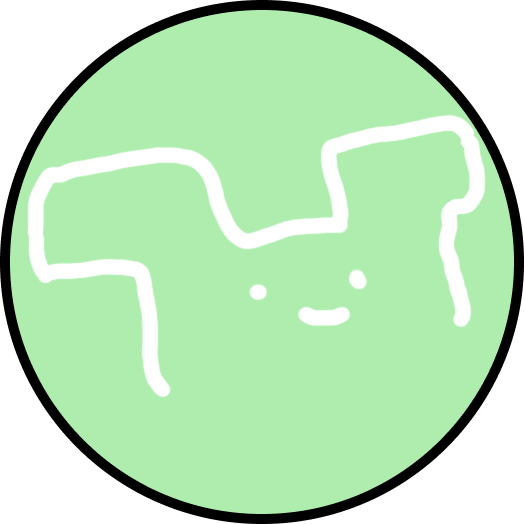

# Hi! I am sponk!

<!--WEBSITE DIED LOL-->
 
 

## Projects
> Currently working on:
> 
> * Discord bot
> * API Wrappers in Python and Javascript
> * An API
> * A website

## I can code in:
 

## My goals
* To learn more programming languages
* To learn more languages (currently know Vietnamese, English)
* To get enough money to build a new pc

## Links

## Stats

